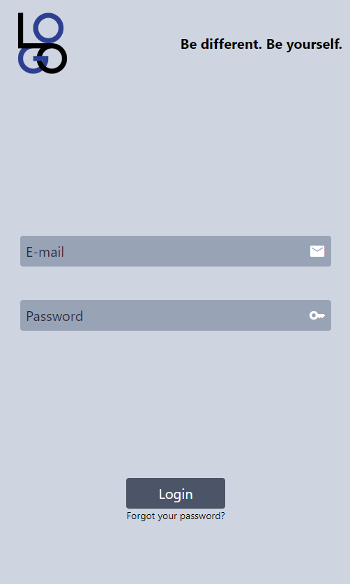
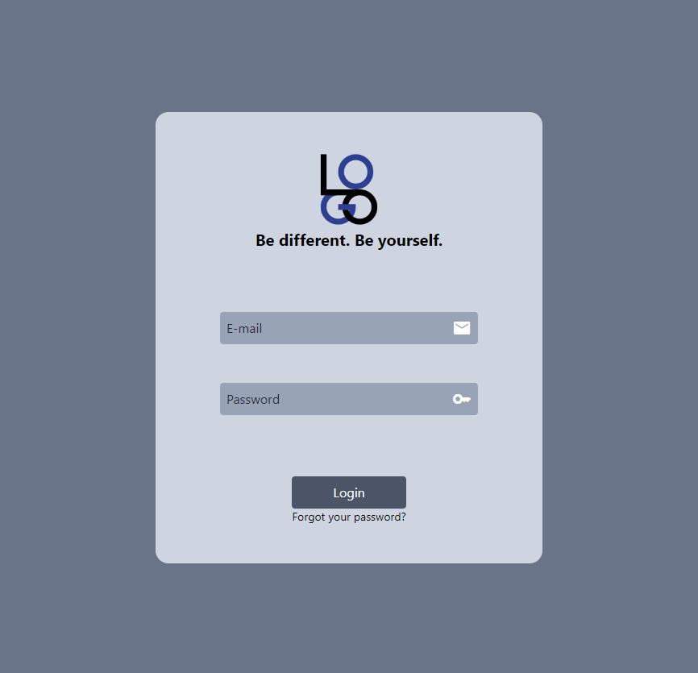
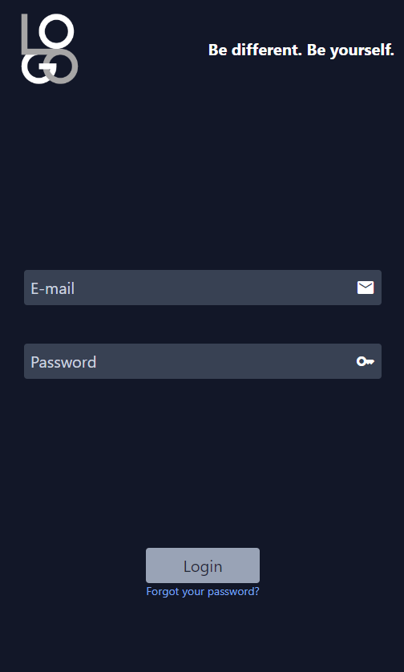
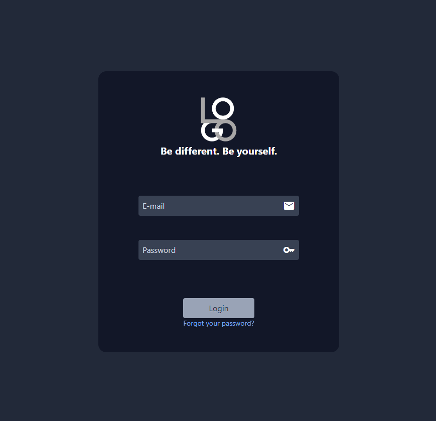

# Página de login

Vamos criar uma página de login responsiva para telas pequenas/médias/grandes, com modo escuro e claro automáticos.

## Modo claro

|Tela pequena|Tela média|Tela grande|
|------------|----------|-----------|
|||

## Modo escuro

|Tela pequena|Tela média|Tela grande|
|------------|----------|-----------|
|||

## Imagens utilizadas

Os exemplos utilizam os seguintes artefatos:

* [logo.png](logo.png)
* [logoDark.png](logoDark.png)
* [imagem.jpg](imagem.jpg) (Foto de <a href="https://unsplash.com/pt-br/@ryoji__iwata?utm_content=creditCopyText&utm_medium=referral&utm_source=unsplash">Ryoji Iwata</a> na <a href="https://unsplash.com/pt-br/fotografias/pessoas-caminhando-na-faixa-de-pedestres-X53e51WfjlE?utm_content=creditCopyText&utm_medium=referral&utm_source=unsplash">Unsplash</a>)
  
## Soluções

* [Tela pequena](passo1.md)
* [Tela pequena + média](passo2.md)
* [Tela pequena + média + grande](passo3.md)
