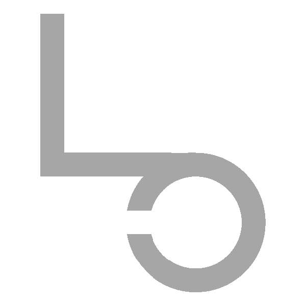

A solução completa:

```html
<!DOCTYPE html>
<html class="">

<head>
    <meta charset='utf-8'>
    <title>Laboratório 1</title>
    <meta name='viewport' content='width=device-width, initial-scale=1'>
    <link href="tailwindOutput.css" rel="stylesheet">
    <link href="https://fonts.googleapis.com/icon?family=Material+Icons" rel="stylesheet">
</head>

<body class="w-full h-dvh min-h-dvh  flex items-center justify-center bg-slate-300 md:bg-slate-500 dark:md:bg-slate-800">
    <div class="w-full h-full lg:grid-cols-2 lg:grid">
        <div class="bg-[url('imagem.jpg')] bg-center bg-cover lg:flex items-center justify-center hidden">
            <div class="w-full h-full flex flex-col gap-y-8 items-center justify-center bg-slate-300/70 dark:bg-slate-800/70">
                </img>
                </img>
                <div class="text-xl font-bold dark:text-white">Be different. Be yourself.</div>
            </div>
        </div>
        <div class="w-full h-full flex items-center justify-center">
            <div
                class="w-full h-full md:w-fit md:h-fit flex flex-col items-center justify-between  md:p-12 md:rounded-2xl gap-y-3 bg-slate-300 dark:bg-slate-900">
                <div class="w-full p-4 md:p-0 flex flex-row justify-between items-center mb-8 md:flex-col lg:hidden ">
                    </img>
                    </img>
                    <div class="text-xl font-bold text-right dark:text-white">Be different. Be yourself.</div>
                </div>
                <div class="w-full flex flex-col items-center gap-y-12 p-8">
                    <div class="w-full md:w-80 relative flex justify-end items-center">
                        <input placeholder="E-mail"
                            class="w-full text-xl md:text-base rounded p-2 outline-0 bg-slate-400 text-slate-800 placeholder:text-slate-800  focus:bg-slate-500 dark:bg-slate-700 dark:text-slate-300 dark:placeholder:text-slate-300  dark:focus:bg-slate-600" />
                        <i class="material-icons text-white absolute mr-2">mail</i>
                    </div>
                    <div class="w-full relative flex justify-end items-center">
                        <input type="password" placeholder="Password"
                            class="w-full text-xl md:text-base rounded p-2 outline-0 bg-slate-400 text-slate-800 placeholder:text-slate-800  focus:bg-slate-500 dark:bg-slate-700 dark:text-slate-300 dark:placeholder:text-slate-300  dark:focus:bg-slate-600" />
                        <i class="material-icons text-white absolute mr-2">key</i>
                    </div>
                </div>
                <div class="flex flex-col justify-end mb-24 md:mb-0">
                    <button
                        class="select-none text-xl md:text-base mt-8 rounded p-2 w-full bg-slate-600 text-white  hover:bg-blue-700 active:bg-blue-500 dark:bg-slate-400 dark:text-slate-800 dark:hover:bg-blue-900 dark:hover:text-blue-300 dark:active:bg-blue-700">Login</button>
                    <div class="w-full text-right text-sm select-none"><a href="#" class="hover:text-blue-700 dark:text-blue-400 dark:hover:text-blue-200">Forgot
                            your
                            password?</a></div>
                </div>
            </div>
        </div>
    </div>
</body>

</html>
```